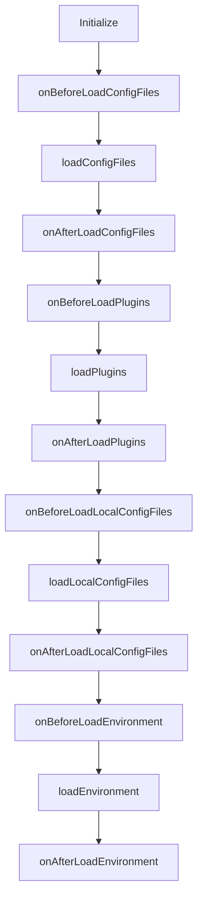

# Config Dug

Config Management library for Node.js


## Major features

- Strongly typed config object
- Specify config schema with [Zod](https://github.com/colinhacks/zod)
  - Support for many data types including: `string`, `number`, `boolean`, `array`, `object`, `enum`, `date` and more
- Plugin support with included plugins for AWS Secrets Manager and AWS AppConfig
  - Live reloading of config values from plugins
- Compatible with dependency injection frameworks like [tsyringe](https://github.com/microsoft/tsyringe) and [InversifyJS](https://github.com/inversify/InversifyJS)
- Support for CJS and ESM projects

## Usage

### Installing

```sh
npm install config-dug
```

### Basic Usage

```ts
import { ConfigDug, z } from 'config-dug';

const schema = {
  logLevel: z.string().default('info'),
};

const config = await ConfigDug.getConfig(schema);
```

### Advanced Usage

```ts
import { ConfigDug, z } from 'config-dug';
import { AWSSecretsManagerPlugin } from '@config-dug/plugin-aws-secrets-manager';

const schema = {
  logLevel: z.string().default('info'),
  apiToken: {
    schema: z.string(),
    sensitive: true,
  },
};

const awsSecretsManagerPlugin = new AWSSecretsManagerPlugin({
  secrets: [
    {
      name: 'config-dug-test/config',
      region: 'ca-central-1',
      reloadInterval: '1m',
    },
  ],
});

const configDug = new ConfigDug(schema, { plugins: [awsSecretsManagerPlugin] });

configDug.on('config-loaded', (config) => {
  console.log('config-loaded event received', config);
});

configDug.on('config-reloaded', (config) => {
  console.log('config-reloaded event received', config);
});

await configDug.load();

const getConfig = () => {
  return configDug.getConfig();
};

export { getConfig };
```

### Options

<!-- prettier-ignore -->
| Name | Type | Default | Description |
| ---- | ---- | ------- | ------------|
| `basePath` | `string` | `process.cwd()` | The directory to load config files from |
| `envKey` | `string` | `APP_ENV` | The environment variable specifying the application environment |
| `loadConfigFiles` | `boolean` | `true` | Load config values from `config.*.{js|cjs|mjs}` files |
| `loadEnvironment` | `boolean` | `true` | Load config values from the environment |
| `plugins` | | `[]` | An array of plugins to load. Plugins are evaluated in order so config values that come from a plugin that is specified later will override config values from plugins specified earlier |
| `printConfig` | `boolean` | `false` | Print the resolved config when loaded |
| `strict` | `boolean` | `false` | When `false` config values are preprocessed first to coerce them to the specified type |
| `warnOnLocalConfigFile` | `boolean` | `true` | Print a warning when a local config file `config.*.local.{js|cjs|mjs}` is loaded |

## Plugins

- TODO: Add instructions on using plugins
- TODO: Add a guide on writing plugins

### Plugin Interface

Create a plugin by extending the `BaseConfigDugPlugin` class. The type argument specifies the particular options your plugin accepts, which itself must extend `ConfigDugPluginOptions`.

```ts
interface MyPluginOptions extends ConfigDugPluginOptions {
  // ...
}

class MyPlugin extends BaseConfigDugPlugin<MyPluginOptions> {
  // ...
}
```

#### Plugin Return Value

```ts
{
  values: UntypedConfig, // Record<string, unknown>
  valueOrigins: ValueOrigins, // Record<string, string[]>
  nextReloadIn: number | undefined
}
```

#### Plugin Lifecycle



## Contributing

TODO: Add CONTRIBUTING.md

## Credits

v2 was inspired by [Zod](https://github.com/colinhacks/zod) and [znv](https://github.com/lostfictions/znv)

v1 was inspired by [config3](https://github.com/focusaurus/config3) and [config4](https://github.com/autolotto/config4)

## License

MIT
